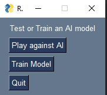
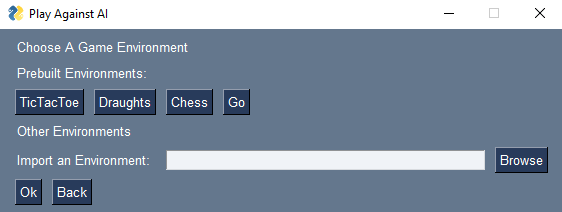
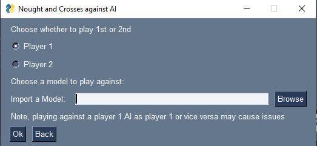
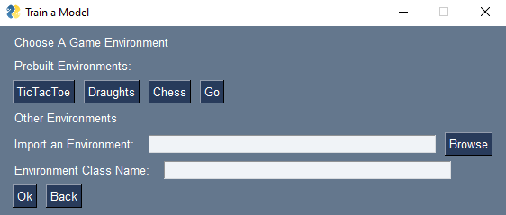
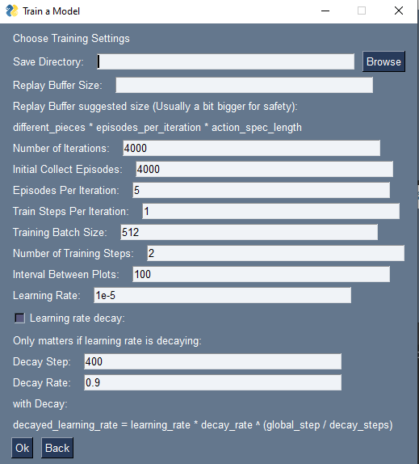

# reinforcement-board-game
A software system to train and the play against AI models.
Uses a digital implementation of the rules of said game and a consistent environment structure to pass to the agent which uses a trainable policy to choose moves in the game environment.

# Installation
Code tested and written using python 3.10

To execute a version of python must be installed, all dependencies are contained in 'requirements.txt'
to install dependencies run (in the root of the project):
```
pip install -r requirements.txt
```
Currently, the project is not packaged into an executable as it uses dynamic imports to allow for modularity in the game modules available

# Use
The app can be executed by executing main.py, e.g. from 'reinforcement-board-game\src':
```
python main.py
```
The application contains several menus

The first menu presented is the main menu: \
 \
Play against the AI allows you to choose an existing game to play or a new environment to import. \
 \
All prebuilt environments use the following GUI to choose the model and player clicking "Ok" will start the game and begin rendering the environment. \
 \
Train Model allows users to train models to play a given environment, you can either train a model on a prebuilt environment or a new one. \
 \
To train a model several parameters need to be specified which can be done in the following GUi, it should be noted that the training process is limited largely to the console and will take a long time. \
 \
Training a model in a folder which already contains a model will overwrite it.

Chess, Draughts and Tic Tac Toe currently use pygame for rendering and moves can be selected on the screen, Go uses the console and moves are selected using console input

# Folder Structure
This project has the following folder structure:
```
├── src                                    # Source files
│   ├── models                             # Pretrained models
│   │   ├── chess                          # Chess models
│   │   │   ├── checkpoint                 # Stored checkpoint files to resume training
│   │   │   │   ├── player_1               # Player 1 files
│   │   │   │   └── player_2               # Player 2 files
│   │   │   └── saved                      # Saved policy location ro restore for playing
│   │   │       ├── player_1               # Player 1 files
│   │   │       └── player_2               # Player 2 files
│   │   ├── draughts                       # Draughts models
│   │   ├── go                             # Go models
│   │   └── tic_tac_toe                    # Noughts and Crosses models
│   ├── modules                            # Game Modules (only prebuilt ones distributed)
│   │   ├── chess                          # Chess environment
│   │   │   ├── images                     # Stored images used for rendering
│   │   │   ├── chess_environment.py       # The chess environment with rules and processing
│   │   │   ├── ChessGUI_pygame.py         # Handles the rendering of the chess board
│   │   │   └── play.py                    # Handles playing against the trained model
│   │   ├── draughts                       # Draughts environment
│   │   │   ├── images                     # Stored images used for rendering
│   │   │   ├── draughts_enmvironment.py   # The draughts environment with rules and processing
│   │   │   ├── draughtsGUI_pygame.py      # Handles the rendering of the chess board
│   │   │   └── play.py                    # Handles playing against the trained model
│   │   ├── go                             # Go environment
│   │   │   ├── go_environment.py          # The go environment with rules and processing
│   │   │   └── play.py                    # Handles playing against the trained model and rendering in console
│   │   ├── tic_tac_toe                    # Noughts and Crosses environment
│   │   │   ├── icons                      # Stored images used for rendering
│   │   │   ├── play.py                    # Handles playing against the trained model
│   │   │   ├── tic_tac_toe_environment.py # Tic Tac Toe environment without support for multiple agents
│   │   │   └── tic_tac_toe_multi.py       # Implements multiple agents in Tic Tac Toe environment
│   │   └── env_flags.py                   # Stores all reward flags shared between environments
│   ├── play                               # Code for playing against the trained models
│   │   ├── human_agent.py                 # An agent that performs environment actions specified by user input
│   │   └── user_interface.py              # GUI to let user choose an environment to play against
│   └── train                              # Code for training the models
│       ├── multi_agent.py                 # An agent that give the environment a value used to identify it
│       ├── network.py                     # Contains network specification and masking to remove illegal actions
│       ├── train_py_env.py                # Code for training an model on a specified environment
│       └── user_interface.py              # GUI to let user specify training parameters
├── LICENSE                                # General Public Use license
├── README.md                              # README
├── requirements.txt                       # Requirements file used to install python dependencies
└── setup.py                               # Setup file used for package distribution
```
All model folders have the same format and contain data for a model trained for each side of the game

# Pretrained Models
Pretrained models are included for Chess, Draughts Tic Tac Toe and Go, all of these models are trained using the existing game environments included, all models are trained using the following parameters:
```
Number of Iterations: 4000
Initial Collect Episodes: 5
Episodes Per Iteration: 5
Train Steps Per Iteration: 1
Training Batch Size: 512
Number of Training Steps: 2
Interval Between Plots: 1000
Learning Rate: 1e-5,
Learning rate decay: True,
Decay Step: 400,
Decay Rate: 0.9
```
The replay buffer size is different for each game as they have differing observation and action spaces:
```
Chess Replay Buffer: 15 * episodes_per_iteration * 4098 = 307350
Draughts Replay Buffer: 6 * episodes_per_iteration * 4096 = 122880
Go Replay Buffer: 4 * episodes_per_iteration * 361 = 7220
Tic Tac Toe Replay Buffer: 4 * episodes_per_iteration * 10 = 200
```
The current Chess and Go models only completed 2000 and 1000 iterations respectively (and this took multiple days) due to the complexity of the game engine due to having to check for illegal moves and check.
